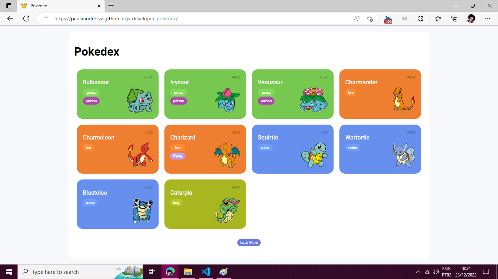
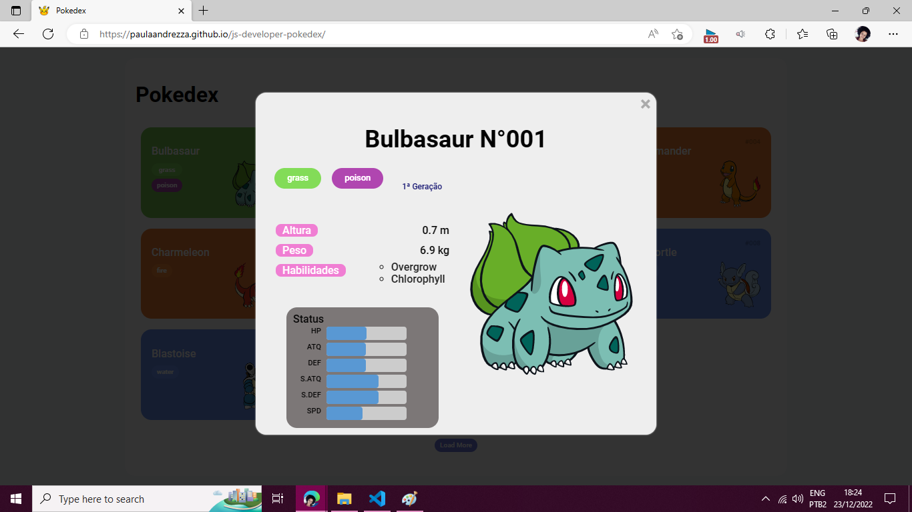

<h1 align="center"> Trilha JS Developer - Pokedex </h1>

Projeto desenvolvido como desafio do bootcamp Orange Tech da DIO.

  <a href="#-tecnologias">Tecnologias</a>&nbsp;&nbsp;&nbsp;|&nbsp;&nbsp;&nbsp;
  <a href="#-projeto">Projeto</a>&nbsp;&nbsp;&nbsp;

 

  
  

 

## 🚀 Tecnologias

Esse projeto foi desenvolvido com as seguintes tecnologias:

- HTML e CSS
- JavaScript
 

## 💻 Projeto

O projeto simula uma pokedex com inforamações sobre os pokemons, de forma responsiva. Você pode ver o projeto [clicando aqui](https://paulaandrezza.github.io/js-developer-pokedex/).

---